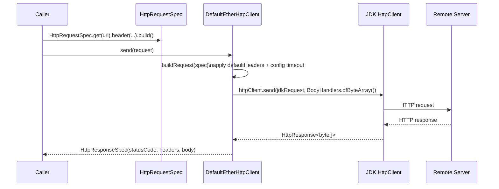

# ether-http-client

Lightweight, immutable HTTP client built on `java.net.http.HttpClient` (JDK 11+) with JSON serialisation via `ether-json`. Intended as the outbound counterpart to `ether-http-core`.

## Maven Dependency

```xml
<dependency>
    <groupId>dev.rafex.ether.http</groupId>
    <artifactId>ether-http-client</artifactId>
    <version>8.0.0-SNAPSHOT</version>
</dependency>
```

## Overview

`ether-http-client` wraps the JDK `java.net.http.HttpClient` with immutable request/response records and JSON helpers powered by `ether-json`. It avoids hiding transport concerns behind opaque abstractions — the full request and response are represented as explicit data structures that are easy to inspect, log, and test.

Key design choices:

- **Immutable records** for `HttpRequestSpec`, `HttpResponseSpec`, and `HttpClientConfig`.
- **`EtherHttpClient` interface** for easy mocking in unit tests.
- **`DefaultEtherHttpClient`** as the concrete implementation backed by the JDK client.
- **JSON integration** via `jsonBody(value)` on the builder and `sendJson(...)` on the client.
- **Sane defaults** — 10-second connect timeout, 30-second request timeout, `NORMAL` redirect policy.

---

## Request / Response Flow



For JSON operations, `sendJson(request, type)` calls `send()` internally and deserialises the response body using the configured `JsonCodec`.

---

## API Reference

### `EtherHttpClient`

The primary interface. Implement it for testing or to wrap a different transport.

```java
public interface EtherHttpClient extends AutoCloseable {
    HttpResponseSpec send(HttpRequestSpec request) throws IOException, InterruptedException;
    HttpResponseSpec get(URI uri) throws IOException, InterruptedException; // default
    <T> T sendJson(HttpRequestSpec request, TypeReference<T> typeReference) throws ...;
    <T> T sendJson(HttpRequestSpec request, Class<T> type) throws ...;
}
```

### `DefaultEtherHttpClient`

The concrete implementation backed by `java.net.http.HttpClient`.

```java
// Three static factory methods:
DefaultEtherHttpClient.create();                       // default config + default JsonCodec
DefaultEtherHttpClient.create(HttpClientConfig config);
DefaultEtherHttpClient.create(JsonCodec jsonCodec);    // default config + custom codec
```

Additional convenience methods beyond the interface:

```java
<T> T sendJson(HttpMethod method, URI uri, Object body, Class<T> responseType);
<T> T sendJson(HttpMethod method, URI uri, Object body, TypeReference<T> responseType);
HttpResponseSpec sendText(HttpMethod method, URI uri, String body);
```

### `HttpRequestSpec`

An immutable record describing a single HTTP request. Constructed via a fluent `Builder`.

```java
public record HttpRequestSpec(
    HttpMethod method,
    URI uri,
    Map<String, List<String>> headers,
    byte[] body,
    Duration timeout
) { ... }
```

Builder static factories:

| Factory | HTTP method |
|---|---|
| `HttpRequestSpec.get(uri)` | GET |
| `HttpRequestSpec.post(uri)` | POST |
| `HttpRequestSpec.put(uri)` | PUT |
| `HttpRequestSpec.patch(uri)` | PATCH |
| `HttpRequestSpec.delete(uri)` | DELETE |
| `HttpRequestSpec.builder(method, uri)` | any |

Builder methods:

| Method | Effect |
|---|---|
| `.header(name, value)` | Add a request header |
| `.contentType(ct)` | Set `Content-Type` header |
| `.body(byte[])` | Set raw body |
| `.body(String)` | Set body as UTF-8 string |
| `.jsonBody(value)` | Serialise `value` to JSON; sets `Content-Type: application/json` |
| `.jsonBody(value, codec)` | Same but with an explicit codec |
| `.timeout(Duration)` | Override the per-request timeout |

### `HttpResponseSpec`

An immutable record wrapping the HTTP response.

```java
public record HttpResponseSpec(
    int statusCode,
    Map<String, List<String>> headers,
    byte[] body
) { ... }
```

Helpers: `isSuccess()` (2xx check), `bodyAsString()` (UTF-8 string).

### `HttpClientConfig`

Configuration record for the underlying JDK client. Built via `HttpClientConfig.builder()`.

| Field | Default | Description |
|---|---|---|
| `connectTimeout` | 10s | TCP connection timeout |
| `requestTimeout` | 30s | Per-request read timeout |
| `redirectPolicy` | `NORMAL` | Follow non-downgrade redirects |
| `userAgent` | `ether-http-client/1.0` | User-Agent header |
| `defaultHeaders` | empty | Added to every request |

### `HttpMethod`

Enum of supported verbs: `GET`, `POST`, `PUT`, `PATCH`, `DELETE`, `HEAD`, `OPTIONS`. `verb()` returns the uppercase name string.

---

## Examples

### 1. Create a client with a base URL and default headers

```java
import dev.rafex.ether.http.client.config.HttpClientConfig;
import dev.rafex.ether.http.client.impl.DefaultEtherHttpClient;
import java.net.http.HttpClient;
import java.time.Duration;

// Configure a client aimed at a downstream microservice.
var config = HttpClientConfig.builder()
    .connectTimeout(Duration.ofSeconds(5))
    .requestTimeout(Duration.ofSeconds(15))
    .redirectPolicy(HttpClient.Redirect.NORMAL)
    .userAgent("my-service/1.0")
    .defaultHeader("Accept",          "application/json")
    .defaultHeader("X-Request-Source", "my-service")
    .build();

var client = DefaultEtherHttpClient.create(config);

// The client is AutoCloseable — use try-with-resources for short-lived usage:
try (var shortLivedClient = DefaultEtherHttpClient.create(config)) {
    var response = shortLivedClient.get(java.net.URI.create("https://api.example.com/health"));
    System.out.println(response.statusCode()); // 200
}
```

---

### 2. GET request and deserialise response to a Java record

```java
import dev.rafex.ether.http.client.impl.DefaultEtherHttpClient;
import dev.rafex.ether.http.client.model.HttpRequestSpec;
import java.net.URI;

// Java 21 record matching the remote API's response shape.
record User(String id, String name, String email) {}

var client = DefaultEtherHttpClient.create();

// Deserialise directly to a typed record:
var user = client.sendJson(
    HttpRequestSpec.get(URI.create("https://api.example.com/users/42")).build(),
    User.class
);

System.out.println(user.name());  // "Alice"
System.out.println(user.email()); // "alice@example.com"

// Deserialise to a generic list:
import com.fasterxml.jackson.core.type.TypeReference;
import java.util.List;

var users = client.sendJson(
    HttpRequestSpec.get(URI.create("https://api.example.com/users")).build(),
    new TypeReference<List<User>>() {}
);

System.out.println(users.size()); // e.g. 10
```

---

### 3. POST request with a JSON body

```java
import dev.rafex.ether.http.client.impl.DefaultEtherHttpClient;
import dev.rafex.ether.http.client.model.HttpRequestSpec;
import java.net.URI;

// Request and response DTO records.
record CreateUserRequest(String name, String email, String role) {}
record User(String id, String name, String email, String role) {}

var client = DefaultEtherHttpClient.create();

var newUser = new CreateUserRequest("Bob", "bob@example.com", "ADMIN");

// jsonBody() serialises the record and sets Content-Type: application/json.
var created = client.sendJson(
    HttpRequestSpec.post(URI.create("https://api.example.com/users"))
        .jsonBody(newUser)
        .header("Authorization", "Bearer " + accessToken)
        .build(),
    User.class
);

System.out.println("Created user: " + created.id());

// Using the convenience overload on DefaultEtherHttpClient directly:
var client2 = DefaultEtherHttpClient.create();
var created2 = client2.sendJson(
    dev.rafex.ether.http.client.model.HttpMethod.POST,
    URI.create("https://api.example.com/users"),
    newUser,
    User.class
);
```

---

### 4. PUT and PATCH requests

```java
import dev.rafex.ether.http.client.impl.DefaultEtherHttpClient;
import dev.rafex.ether.http.client.model.HttpRequestSpec;
import java.net.URI;

record UpdateUserRequest(String name, String email) {}
record PatchUserRequest(String name) {}  // partial update
record User(String id, String name, String email) {}

var client = DefaultEtherHttpClient.create();
var baseUri = URI.create("https://api.example.com/users/42");

// PUT — replace the entire resource:
var updated = client.sendJson(
    HttpRequestSpec.put(baseUri)
        .jsonBody(new UpdateUserRequest("Alice Updated", "alice2@example.com"))
        .header("Authorization", "Bearer " + token)
        .build(),
    User.class
);

// PATCH — partial update:
var patched = client.sendJson(
    HttpRequestSpec.patch(baseUri)
        .jsonBody(new PatchUserRequest("Alice Renamed"))
        .header("Authorization", "Bearer " + token)
        .build(),
    User.class
);

// DELETE — no response body expected:
var deleteResponse = client.send(
    HttpRequestSpec.delete(baseUri)
        .header("Authorization", "Bearer " + token)
        .build()
);
System.out.println(deleteResponse.statusCode()); // 204
System.out.println(deleteResponse.isSuccess());  // true
```

---

### 5. Handle error responses (4xx, 5xx)

`HttpResponseSpec.isSuccess()` checks the 2xx range. For non-success responses, inspect the status code and body manually or throw an application exception.

```java
import dev.rafex.ether.http.client.impl.DefaultEtherHttpClient;
import dev.rafex.ether.http.client.model.HttpRequestSpec;
import dev.rafex.ether.http.client.model.HttpResponseSpec;
import java.net.URI;

// Application-level exception wrapping a failed HTTP call.
record ApiError(int status, String body) {}
class ApiException extends RuntimeException {
    private final ApiError error;
    ApiException(ApiError error) {
        super("HTTP " + error.status() + ": " + error.body());
        this.error = error;
    }
    ApiError error() { return error; }
}

var client = DefaultEtherHttpClient.create();

HttpResponseSpec response = client.send(
    HttpRequestSpec.get(URI.create("https://api.example.com/users/9999")).build()
);

// Check before using the body:
if (!response.isSuccess()) {
    var error = new ApiError(response.statusCode(), response.bodyAsString());
    throw new ApiException(error);
}

// Status-code dispatch using a Java 21 switch expression:
var result = switch (response.statusCode()) {
    case 200 -> "OK: " + response.bodyAsString();
    case 404 -> "Not found";
    case 429 -> "Rate limited — retry after a moment";
    case 500, 502, 503 -> "Server error: " + response.statusCode();
    default  -> "Unexpected status: " + response.statusCode();
};

System.out.println(result);

// Inspect response headers (e.g. Retry-After):
var retryAfter = response.headers().getOrDefault("retry-after", java.util.List.of());
if (!retryAfter.isEmpty()) {
    System.out.println("Retry after: " + retryAfter.get(0) + " seconds");
}
```

---

### 6. Use with `ether-json` for custom serialisation

```java
import dev.rafex.ether.http.client.impl.DefaultEtherHttpClient;
import dev.rafex.ether.http.client.model.HttpRequestSpec;
import dev.rafex.ether.json.JsonCodec;
import dev.rafex.ether.json.JsonUtils;
import com.fasterxml.jackson.databind.ObjectMapper;
import com.fasterxml.jackson.databind.PropertyNamingStrategies;
import java.net.URI;

// Suppose the remote API uses snake_case JSON fields.
// Configure a custom ObjectMapper and wrap it in the ether JsonCodec.
var snakeCaseMapper = new ObjectMapper()
    .setPropertyNamingStrategy(PropertyNamingStrategies.SNAKE_CASE)
    .findAndRegisterModules();

JsonCodec snakeCaseCodec = JsonUtils.codec(snakeCaseMapper);

var client = DefaultEtherHttpClient.create(snakeCaseCodec);

// Records with camelCase fields are automatically mapped to/from snake_case JSON.
record RemoteUser(String userId, String fullName, String emailAddress) {}

var user = client.sendJson(
    HttpRequestSpec.get(URI.create("https://partner-api.example.com/v1/users/1")).build(),
    RemoteUser.class
);
// JSON {"user_id":"1","full_name":"Alice","email_address":"alice@example.com"}
// is mapped to RemoteUser("1", "Alice", "alice@example.com")

// POST with the same codec:
record CreateRemoteUser(String fullName, String emailAddress) {}
var request = new CreateRemoteUser("Bob", "bob@example.com");

var created = client.sendJson(
    HttpRequestSpec.post(URI.create("https://partner-api.example.com/v1/users"))
        .jsonBody(request, snakeCaseCodec)
        .build(),
    RemoteUser.class
);
// Request body: {"full_name":"Bob","email_address":"bob@example.com"}
```

---

### 7. Service-to-service calls in a handler

A common pattern is to inject `EtherHttpClient` into a handler or service and call a downstream API.

```java
import dev.rafex.ether.http.client.EtherHttpClient;
import dev.rafex.ether.http.client.model.HttpRequestSpec;
import dev.rafex.ether.http.core.HttpExchange;
import dev.rafex.ether.http.core.HttpHandler;
import java.net.URI;
import java.util.Map;

record Product(String id, String name, double price) {}

public final class ProductHandler implements HttpHandler {

    private final EtherHttpClient inventoryClient;
    private final String inventoryBaseUrl;

    public ProductHandler(EtherHttpClient inventoryClient, String inventoryBaseUrl) {
        this.inventoryClient = inventoryClient;
        this.inventoryBaseUrl = inventoryBaseUrl;
    }

    @Override
    public boolean handle(HttpExchange exchange) throws Exception {
        var productId = exchange.pathParam("id");
        var uri = URI.create(inventoryBaseUrl + "/products/" + productId);

        var response = inventoryClient.send(HttpRequestSpec.get(uri).build());

        if (response.statusCode() == 404) {
            exchange.json(404, Map.of("error", "product_not_found"));
            return true;
        }
        if (!response.isSuccess()) {
            exchange.json(502, Map.of("error", "upstream_error",
                "status", response.statusCode()));
            return true;
        }

        // Parse and forward the product.
        var product = inventoryClient.sendJson(
            HttpRequestSpec.get(uri).build(),
            Product.class
        );
        exchange.json(200, product);
        return true;
    }
}

// Wiring at startup:
var config = HttpClientConfig.builder()
    .connectTimeout(Duration.ofSeconds(3))
    .requestTimeout(Duration.ofSeconds(10))
    .defaultHeader("Accept", "application/json")
    .build();

EtherHttpClient inventoryClient = DefaultEtherHttpClient.create(config);
var handler = new ProductHandler(inventoryClient, "https://inventory.internal");
```

---

## Configuration Reference

```java
import dev.rafex.ether.http.client.config.HttpClientConfig;
import java.net.http.HttpClient;
import java.time.Duration;

HttpClientConfig config = HttpClientConfig.builder()
    // TCP connection establishment timeout.
    .connectTimeout(Duration.ofSeconds(10))
    // Per-request read/write timeout (from connection established to last byte received).
    .requestTimeout(Duration.ofSeconds(30))
    // Redirect policy: NEVER, ALWAYS, or NORMAL (never downgrades HTTPS→HTTP).
    .redirectPolicy(HttpClient.Redirect.NORMAL)
    // Value for the User-Agent header on every request.
    .userAgent("my-service/2.0")
    // Default headers merged into every request (per-request headers take precedence).
    .defaultHeader("Accept",       "application/json")
    .defaultHeader("X-Api-Version", "2")
    .build();

// Inspect defaults:
System.out.println(config.connectTimeout()); // PT10S
System.out.println(config.userAgent());      // "my-service/2.0"
```

---

## Notes

- **Thread safety.** `DefaultEtherHttpClient` is thread-safe. The underlying `java.net.http.HttpClient` is designed for concurrent use.
- **Connection pooling.** The JDK client maintains an HTTP/2 connection pool automatically. For HTTP/1.1 keep-alive, it reuses connections within the same `DefaultEtherHttpClient` instance.
- **Lifecycle.** `EtherHttpClient extends AutoCloseable`. The default `close()` implementation is a no-op — the JDK client manages its own lifecycle. Override or extend for custom cleanup.
- **Body bytes are copied.** The `HttpRequestSpec` and `HttpResponseSpec` constructors clone the body byte arrays defensively.
- **`sendJson` throws on non-2xx.** `sendJson(request, type)` calls `send()` and then deserialises. If the server returns a 4xx or 5xx, the body may not be valid JSON for the target type. Check `send()` first if the response might be an error document.

---

## License

MIT License — Copyright (C) 2025-2026 Raúl Eduardo González Argote
